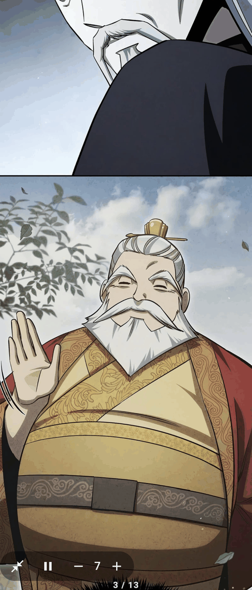
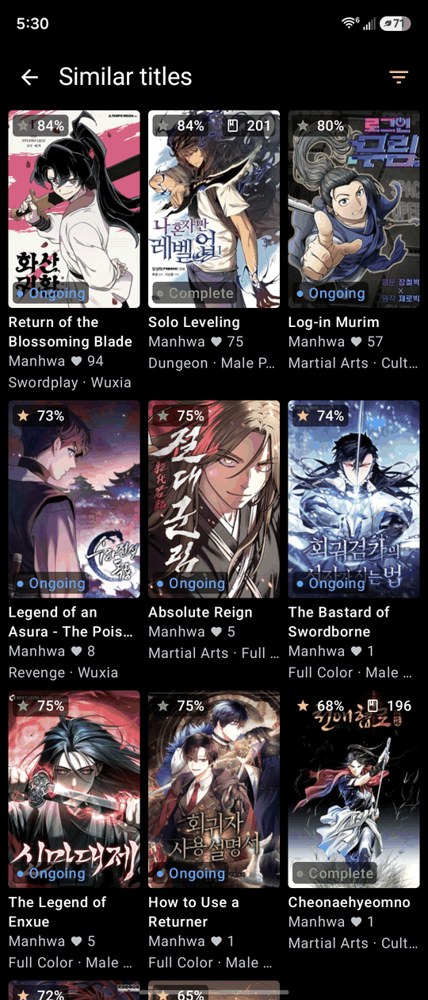
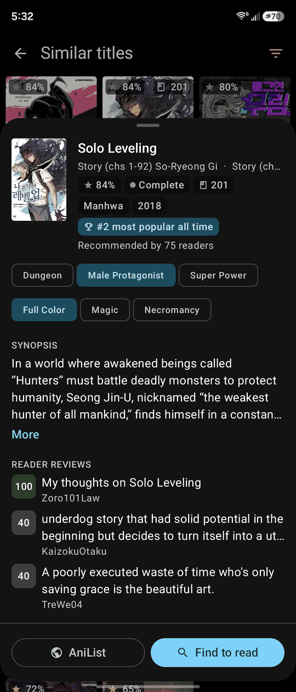
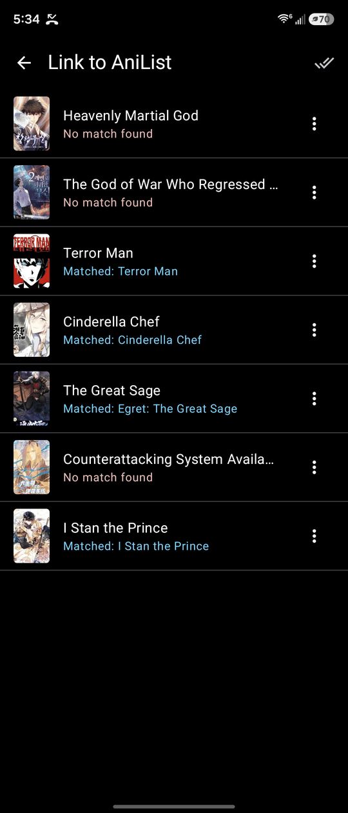

  

# Makimono

### A feature-driven fork of Mihon

Everything Mihon does, plus the features I actually wanted: hands-free webtoon auto-scroll,
AniList-powered discovery and recommendations, a personalized For You feed, cross-source reader
comments, and one-shot bulk tracking.

---

## Contents

- [Install](#install)
- [Migrating from Mihon](#migrating-from-mihon)
- [Highlights](#highlights)
- [Screenshots](#screenshots)
- [Feature guide](#feature-guide)
  - [Webtoon auto-scroll](#webtoon-auto-scroll)
  - [Similar titles (AniList recommendations)](#similar-titles-anilist-recommendations)
  - [Discover (browse by AniList tags)](#discover-browse-by-anilist-tags)
  - [For You (personalized feed)](#for-you-personalized-feed)
  - [Reader comments](#reader-comments)
  - [Bulk AniList tracking](#bulk-anilist-tracking)
  - [Fold-aware reader margins](#fold-aware-reader-margins)
  - [Reliable backups](#reliable-backups)
  - [Choose your app icon](#choose-your-app-icon)
- [Feedback and requests](#feedback-and-requests)
- [Built on Mihon](#built-on-mihon)
- [License](#license)
- [Disclaimer](#disclaimer)

---

## Install

1. Download the latest `app-universal-release.apk` from the [**Releases**](https://github.com/Tsuji-Hub/makimono/releases/latest) page.
2. Open it on your Android device and allow install. Play Protect may run a quick scan on install; that is normal for a sideloaded app.
3. Makimono installs as its **own app, next to Mihon**. It does not touch or replace your Mihon.

*Requires Android 8.0 or higher.*

> [!NOTE]
> Once installed, you never have to sideload again. Updates arrive **inside the app**, no re-sideloading.

## Migrating from Mihon

Your whole setup carries over in three steps:

1. In **Mihon**: Settings > Data and storage > **Create backup**.
2. In **Makimono**: Settings > Data and storage > **Restore backup** (pick that file).
3. **Re-trust your extensions** once. Android strips the "trusted" flag out of backups for security, so after a fresh install you re-enable your sources a single time.

Your library, reading progress, categories, and tracking all come with you.

---

## Highlights

- **Webtoon auto-scroll** with adjustable speed, a floating controller, two-finger tap, and volume-key speed control.
- **Similar titles**: AniList-powered recommendations ranked by how well they actually match, with rich filters and an in-place preview.
- **Discover**: browse and search the AniList catalog by tag combinations (include *and* exclude tags); opens on Trending so it is never empty.
- **For You**: a personalized feed built from your library's taste, with a weekly rotation and a Refresh button for new picks on demand.
- **Reader comments**: read the discussion for a title from WEBTOON, Comick, and MangaDex, with a tab per source and a chapter picker to jump anywhere.
- **Bulk AniList tracking**: link your entire library (or a category) in one pass instead of one title at a time.
- **Fold-aware reader margins** that switch live between the cover and inner screen on foldables.
- **Backups that fully restore**, including the category settings stock Mihon drops.
- **Choose your app icon** from six crest color variants in Appearance settings.

---

## Screenshots

---

## Feature guide

### Webtoon auto-scroll

**What it is.** Hands-free reading for long-strip / webtoon series. The page scrolls itself at a
speed you control, pauses the moment you touch, and rolls straight through chapter breaks.

**How to use it**

- **Start or stop** it any of three ways:
  - The auto-scroll button in the reader's bottom toolbar (tap once to bring the menu up).
  - A **two-finger tap** anywhere on the page (enable it in settings first).
  - The floating bubble: tap to play or pause.
- **Set the speed (1 to 15, default 3):**
  - **Volume buttons** while it is scrolling: Up = faster, Down = slower.
  - The floating controller's minus and plus buttons.
  - A "Speed N" readout flashes on screen when it changes.
- **The floating controller** starts as a small bubble. Tap it to play/pause, **long-press to expand**
  the full controls, and **drag it anywhere** (it remembers the spot). Adjust its opacity or hide it
  entirely in settings.
- **Pausing is automatic.** Touch and hold, or scroll by hand, and it pauses while you do, then
  **resumes on its own about a second after you let go**. Quick taps still work as normal page taps.
- **Boundaries are handled.** It pauses briefly at the end of a chapter then continues into the next,
  and stops on its own at the end of the series.

*Settings live in the reader settings under the webtoon (long-strip) section: Auto-scroll, Auto-scroll
speed, On-screen controls, On-screen controls opacity, Two-finger tap to start or stop, Volume keys
adjust speed.*

### Similar titles (AniList recommendations)

**What it is.** Open any manga and get recommendations powered by AniList, ranked by how well they
actually match the title you are on (shared tags plus community rating), not a random list.

**How to use it**

- Open a manga and tap **Similar**.
- **Filter** the results: completed-only, minimum chapter count, include/exclude genres and tags, hide
  what is already in your library, or flip on **hidden-gems** mode to surface high-quality, lesser-known titles.
- Each card shows the **match score, status, and chapter count** at a glance.
- **Long-press any card** to preview its synopsis and reader reviews without ever opening a source.

### Discover (browse by AniList tags)

**What it is.** Browse and search the whole AniList catalog by tag. It opens on **Trending**, so there
is always something to see, and you combine **include and exclude** tags to zero in on exactly the kind
of story you want.

**How to use it**

- Open **Browse** and tap **Discover** (it opens on Trending right away, never a blank "pick a tag" screen).
- Open the **tag picker**, search genres and tags, and tap each one to set it to **include** or **exclude**
  (for example: include *Isekai* and *Time Travel*, exclude *Harem*).
- Results re-rank by how well they match your included tags. **Long-press** a card to preview it, or **tap**
  to find it across your installed sources.
- Adult tags and titles stay hidden unless you have enabled NSFW sources.

### For You (personalized feed)

**What it is.** A personalized feed built from your own library's taste, the tags and genres you already
read and track on AniList. No setup and no new screen to learn; it works from the library you already have.

**How to use it**

- Open **Browse** and tap **For You**. It builds a taste profile from your AniList-tracked library and
  fills with on-taste titles you do not already own.
- The picks **rotate every week**, so the feed stays fresh, with a countdown to the next rotation.
- Tap **Refresh** (top right) any time you want a new set on demand.
- The more you track on AniList (the **bulk tracker** makes this quick), the sharper it gets. With only a
  few tracked titles it falls back to Trending until it has enough to learn from.

### Reader comments

**What it is.** See what other readers are saying about a title, pulled live from **WEBTOON, Comick, and
MangaDex**. Makimono finds the title on whichever of those has a discussion, so you get comments even when
you read it from a different source. It is **read-only** — a window into the conversation, no account and
no posting.

**How to use it**

- Open any manga and tap **Reader comments** on the detail page.
- If a title has comments on more than one source, a **tab for each** appears (WEBTOON / Comick / MangaDex);
  switch between them freely. WEBTOON also offers a **Top / Newest** sort.
- Use the **chapter picker** (or the ‹ › steppers) at the top to jump to any chapter's comments without
  leaving the screen.
- Turn the feature, or any individual source, on or off in **Settings > Reader > Comments**.

### Bulk AniList tracking

**What it is.** Link your whole library to AniList in one pass, with a review step, instead of adding
every series by hand.

**How to use it**

1. Log in first: Settings > Tracking > **AniList**.
2. In your **Library**, enter selection mode (long-press a title) and select titles, or select an
   entire category.
3. Run the **bulk-link** action. Makimono auto-matches each title to AniList and shows a review screen
   (matched / needs review / no match).
4. Fix any that need it (search manually or exclude), then **Track all** to link them in one shot.

### Fold-aware reader margins

**What it is.** Separate webtoon side margins for a foldable's outer cover screen and inner unfolded
screen, so the page is comfortable in both.

**How to use it.** Nothing to do. The margin switches **live the instant you open or close the phone**.
On non-foldables there is nothing to notice. (Set the two values in the webtoon reader settings.)

### Reliable backups

**What it is.** A fix for a long-standing Mihon annoyance: library **category settings** that stock
Mihon silently drops on restore now come back correctly.

**How to use it.** Automatic. Just restore a backup as usual and your per-category setup survives.

### Choose your app icon

**What it is.** Pick the launcher icon's color to match your taste, with seven crest variants to choose
from. Your notification accent follows your pick, so the whole app stays coordinated.

**How to use it**

- Go to **Settings > Appearance > App icon**.
- Choose from **slate (default), teal, terracotta, indigo, plum, crimson, or gray**.
- The launcher icon updates to your pick and notifications take on its accent color. It may take a moment
  and the app might briefly close, which is normal.

---

## Feedback and requests

This is a personal fork that grows by request. If something about Mihon annoys you, or there is a
feature you have always wanted, **open an issue** or send it over. That is literally how the next
feature gets picked.

---

## Built on Mihon

Makimono is a fork of [**Mihon**](https://github.com/mihonapp/mihon), itself descended from Tachiyomi.
All of the core reading, library, sources, and tracking functionality is Mihon's work; Makimono adds
the features above on top. Huge thanks to the Mihon team and contributors.

> Building from source follows the standard Mihon process (Android Studio, JDK 17, the Android SDK).
> See Mihon's repository for the toolchain details.

## License

Licensed under the Apache License, Version 2.0, the same as upstream Mihon. The original copyright
notices are retained.

<pre>
Copyright © 2015 Javier Tomás
Copyright © 2024 Mihon Open Source Project
Copyright © 2026 Makimono fork contributors

Licensed under the Apache License, Version 2.0 (the "License");
you may not use this file except in compliance with the License.
You may obtain a copy of the License at

    http://www.apache.org/licenses/LICENSE-2.0

Unless required by applicable law or agreed to in writing, software
distributed under the License is distributed on an "AS IS" BASIS,
WITHOUT WARRANTIES OR CONDITIONS OF ANY KIND, either express or implied.
See the License for the specific language governing permissions and
limitations under the License.
</pre>

## Disclaimer

The developer of this application does not have any affiliation with the content providers available,
and this application hosts zero content.
